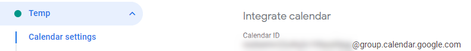
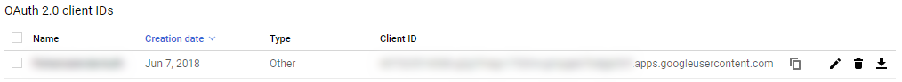

# Norkart Renovasjon to Google Calendar

This small piece of software does the following:

1. Taps into Geonorge to find municipality number based on municipality name
2. Taps into a Norkart Renovasjon API to fetch your yealy renovation schedule in a PDF file
3. Parses and processes the PDF into a CSV format
4. Creates events in Google Calendar based on the dates in your renovation schedule with an email reminder

## Usage

    pip install -r requirements.txt
    cd src
    python runner.py

## Requirements

- The software requires that you setup the `config.ini` with proper values:

  - You need an API key for Norkart Renovasjon API, which actors like [ÅRIM](http://arim.no/din-renovasjon/n%C3%A5r-blir-avfallet-mitt-henta) and [VØR](http://www.vor.no/toemekalender.6137546-470570.html) use:

    

  - You need a Calendar ID which can be found under "Integrate calendar" in a Google calendars settings:

    

- For Google Calendar adding to work you need to replace `client_secrets.json` for OAuth authentication:

  - The file can be obtained from [Google API Console](https://console.developers.google.com/apis/credentials):

    

## Example

See example output below:

    $ python runner.py
    Municipality number: 1520
    PDF URL: https://komteksky.norkart.no/komtek.renovasjonwebapi/Content/7ece650e2665497f9bac50aa9efb1137/T%C3%B8mmekalender.pdf
    Added <Søppel Matavfall, 2019-01-02 06:00:00, 2019-01-02 07:00:00>
    Added <Søppel Restavfall, 2019-01-08 06:00:00, 2019-01-08 07:00:00>
    Added <Søppel Matavfall, 2019-01-15 06:00:00, 2019-01-15 07:00:00>
    Added <Søppel Papp/papir/plast, 2019-01-22 06:00:00, 2019-01-22 07:00:00>
    Added <Søppel Glas/Metallemballasje, 2019-01-23 06:00:00, 2019-01-23 07:00:00>
    ...

Functionality tested and working 2019-11-12 for 2020 renovation schedule.

## License

The software in this repo is released under CC-BY-SA 4.0, also found in the `LICENSE` file.

## Improvements and issues

- Lacking documentation
- Structure could use some cleanup
- No `setup.py`
